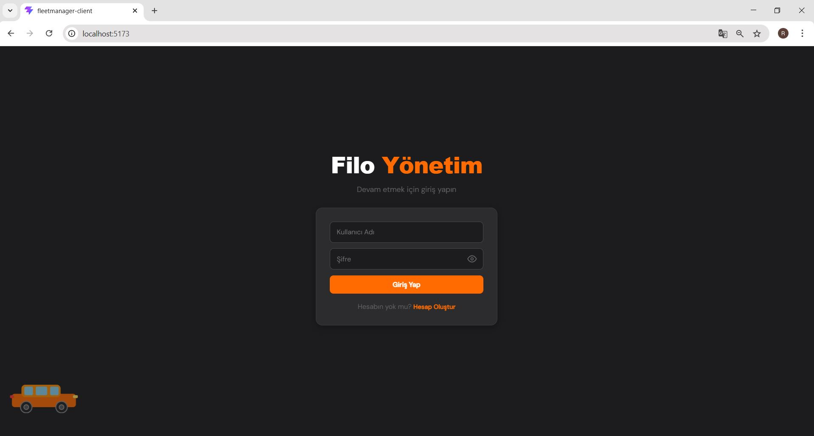
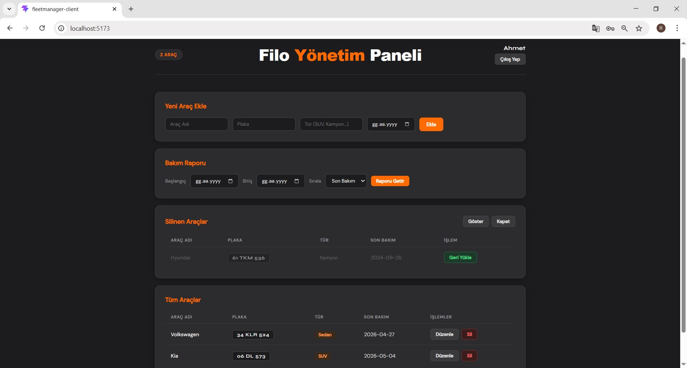
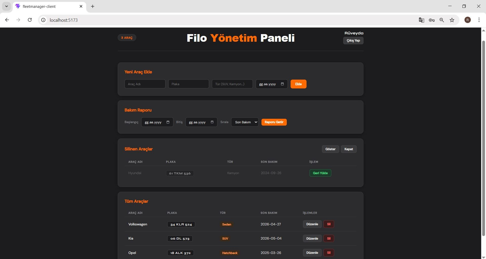

# 🚗 Filo Yönetim Paneli

Araç ekleme, düzenleme, soft delete ve listeleme işlemlerini kapsayan tam yönetim paneli.  
**React · ASP.NET Core · EF Core · PostgreSQL**

---

## 📋 Proje Hakkında

Bu proje bir filo yönetim sistemidir. Kullanıcılar araç ekleyebilir, düzenleyebilir ve silebilir. Silinen araçlar veritabanında korunur (soft delete). Rol bazlı erişim sistemi ile admin tüm araçları görürken standart kullanıcılar yalnızca kendi araçlarını görür. Son 30 gün bakım özeti rapor ekranı filtrelenebilir ve sıralanabilir yapıdadır.

---

## ✅ Karşılanan İsterler

### Beklentiler
- **CRUD işlemleri** — Araç ekleme, düzenleme, silme ve listeleme API + UI olarak eksiksiz çalışır
- **Soft delete** — `IsDeleted` boolean alanı kullanılır, fiziksel silme yapılmaz. EF Core global query filter ile silinen kayıtlar otomatik filtrelenir
- **EF Core** — Tüm ilişkisel şema ve migration dosyaları mevcuttur
- **Rapor ekranı** — Tarih aralığı filtresi ve sıralama (araç adı, plaka, tür, son bakım tarihi) çalışır
- **Form validasyonları** — API katmanında Data Annotations, UI katmanında React state validasyonu ayrı ayrı uygulanmıştır

### Bonus Özellikler
- **CSV export** — Rapor ekranından tek tıkla CSV olarak indirilebilir
- **Rol bazlı erişim** — Admin tüm araçları görür, standart kullanıcı yalnızca kendi `UserId`'siyle eşleşen araçları görür. `UserId` ataması sunucu tarafında JWT token'dan yapılır, client manipülasyonuna kapalıdır
- **Restore** — Silinen araçlar ayrı ekranda listelenir ve geri yüklenebilir

---

## 🏗️ Mimari

```
FleetManager/
├── FleetManager.API/          # ASP.NET Core Web API
│   ├── Controllers/
│   │   ├── AuthController.cs  # Kayıt, giriş, JWT üretimi
│   │   └── VehiclesController.cs  # CRUD, rapor, restore
│   ├── Models/
│   │   ├── AppDbContext.cs    # EF Core context + global query filter
│   │   ├── Vehicle.cs         # IsDeleted, UserId, LastMaintenanceDate
│   │   └── Users.cs           # Username, Email, PasswordHash, Role
│   ├── Migrations/            # EF Core migration dosyaları
│   └── appsettings.json       # Yerel config (git'e gitmez)
└── FleetManager.Client/       # React + Vite
    └── src/
        └── App.jsx            # Tüm frontend 
```

### Teknik Kararlar
- **Soft delete** global query filter ile yönetilir — her sorguda `WHERE is_deleted = false` yazmak yerine EF Core'da bir kez tanımlanır
- **JWT claim'leri** — `UserId` ve `Role` token içinde taşınır, rol kontrolü controller'da yapılır
- **BCrypt** — Şifreler `BCrypt.Net` ile hashlenerek saklanır, düz metin şifre tutulmaz
- **CORS** — Yalnızca `http://localhost:5173` origin'ine izin verilir

---

## 🚀 Kurulum

### Gereksinimler
- .NET 9 SDK
- Node.js 18+
- PostgreSQL 16

### 1. Repo'yu klonlayın
```bash
git clone https://github.com/kullanici/FleetManager.git
cd FleetManager
```

### 2. Veritabanı yapılandırması
`FleetManager.API` klasöründe `appsettings.example.json` dosyasını kopyalayıp `appsettings.json` olarak yeniden adlandırın ve kendi bilgilerinizi girin:

```json
{
  "ConnectionStrings": {
    "DefaultConnection": "Host=localhost;Port=5432;Database=FleetManagerDb;Username=postgres;Password=YOUR_PASSWORD"
  },
  "Jwt": {
    "Key": "EN_AZ_32_KARAKTERLIK_SECRET_KEY_BURAYA",
    "Issuer": "FleetManagerAPI"
  }
}
```

### 3. Backend başlatma
```bash
cd FleetManager.API
dotnet ef database update
dotnet run
```
API `http://localhost:5201` adresinde çalışır.  
Swagger UI: `http://localhost:5201/swagger`

### 4. Frontend başlatma
```bash
cd FleetManager.Client
npm install
npm run dev
```
Uygulama `http://localhost:5173` adresinde açılır.

---

## 👤 Kullanıcı Rolleri

| Rol | Yetki |
|-----|-------|
| **Admin** | Tüm araçları görür, düzenler, siler |
| **User** | Yalnızca kendi eklediği araçları görür |

İlk kayıt sonrası admin yetkisi vermek için:
```sql
UPDATE public."Users" SET "Role" = 'Admin' WHERE "Username" = 'kullanici_adi';
```

---

## 📸 Ekran Görüntüleri





---

## 🛠️ Kullanılan Teknolojiler

| Katman | Teknoloji |
|--------|-----------|
| Frontend | React 18, Vite, Axios |
| Backend | ASP.NET Core 9, C# |
| ORM | Entity Framework Core 9 |
| Veritabanı | PostgreSQL 16 |
| Auth | JWT Bearer Token, BCrypt |
| Dokümantasyon | Swagger / Swashbuckle |